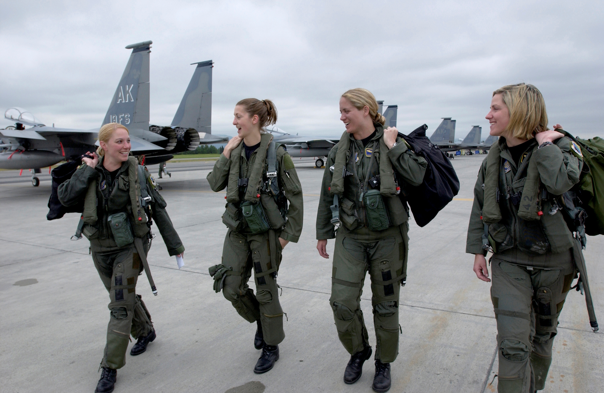

# Do maszyn!

## Spróbujcie utworzyć tablicę w konsoli
- Otwórzcie przeglądarkę Chrome
- Otwórzcie narzędzia programistyczne *(F12 lub Cmd+Opt+I)*
- Zobaczcie, czy możecie utworzyć tablicę `names` jak z poprzednich slajdów, ale z 5 imionami.
- Spróbujcie wypisać kolejne elementy tej tablicy do konsoli, używając funkcji `console.log`
